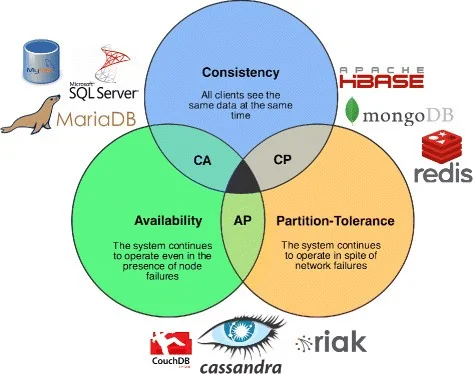

# Modelagem Informacional

## Mecanismos transacionais

**ACID**

_Atomicidade_: Ou uma transação é finalizada ou completamente cancelada

_Concistencia_: A transação deve sair de um estado valido a outro estado valido, de acordo com o que esta modelado

_Isolamento_: Cada transação tem um nivel de isolamento em relação as outras, se espera que sejam totalmente independentes

_Durabilidade_: Refere-se a vida da transação e a sobrevivencia dela frente a falhas do sitema, o que permite a replicação

**Niveis de Concistencia**

_Read uncommitted_: O banco de dados pode realizar transações mesmo com transações que não tenham sido finalizadas.

_Read committed_: O banco de dados so realiza transações depois que transações em andamento sejam comitadas.

_Repetable read_: Quer dizer que dada uma transação realizada os dados lidos por essa transação são congelados e não conseguem ser modificados por nenhuma outra transação ate que a transação atual seja finalizada.

_Serializable_: Bloqueia intervalos, definidos pela minha transação, os quais não podem ser modificados (adicionar ou subtrair linhas) ate que a transação que definiu o intervalo seja finalizada.

Perceba tambem que cada nivel de concistencia é muito mais restritivo que o anterior, solucionando "problemas" que acontecem com niveis menos restritivos

1 -> 2, podemos visualizar informações falsas se fizerem um rolback

2 -> 3, podemos obter mais de um resultado para a mesma transação pois mesmo depois de comitado de um momento a outro podem mudar os dados que limos

3 -> 4, podem ser acresentados novos dados na nossa leitura.

Ao definir o nivel de consistencia mexemos diretamente no _Isolamento_ de nossas transações

**Deadlock**

## Tarefas
- 10/08/2026 Questionario: Envios de Questionário - A Matriz de Zachman no Caso MOBITAXI