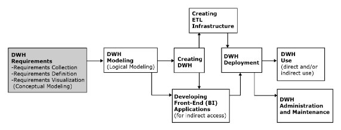

# Conceitos

Fazer relatorios de todo o conteudo ao mesmo que o sistema funciona fazendo bloqueios das transações não funciona bem. Pois o sistema opera com os niveis de isolamento feitos travam a requisição de querer fazer um relatorio ao final do dia/mes. Dessa forma surge o Data Warehouse

B. Inomn: Pai da Data Warehouse
Kimball: Criador do modelo estrela

são os dois maiores pioneiros da história dos Data Warehouses. Eles criaram os conceitos fundamentais sobre como armazenar, organizar e analisar grandes volumes de dados nas empresas

## Informação Transacional vs Analitica

A informação transacional é aquela usada numa transação, fatos, nada é feito com esses dados alem de armazenalos, usalos, movimentalos do jeito certo.
A informação analitica é informação ela usa os dados, analisa, cria metricas

O Data Warehouse busca unir essas duas coisas no mesmo SGBD 

**Algumas diferenças**

Composição dos dados:
- os dados operacionais duram menos tempo (meses) enquanto os dados analiticos podem chegar a durar muito mais (anos)
- dados operacionais são detelhados, analiticos são resumidos
- os dados operacionais são atuais, ja os analiticos estão sobre a linha do tempo

Aspectos tecnicos:
- Um processo de dados operacionas envolve pouco volume de dados enquanto dados analiticos usamos um grande volume de dados pois eles estâo sumarizados (Counnt, Group by)
- Os dados operacionais possuem uma grande frequencia de acesso, enquanto os dados analiticos tem frequencia media ou baixa pois a produção de relatorios/informaçãogeralmente é feita 1 vez ao dia/semana/mes
- Os dados operacionais são constantemente atualizados, enquanto os dados analiticos não podem ser atualizados eles são apenas lidos, o que pode ser feito é adicionar mais dados analiticos
- Os dados operacionais não são redundantes, eles estão apenas em um lugar no banco de dados evitando anomalias de inserção, atualização e remoção enquanto com dado analiticos não é necessario se preocupar com a redundancia

Aspectos Funcionais:
- Os dados operacionais podem ser usados por todo mundo para propositos taticos, ja os dados analiticos são usados para ajudar na tomada de desição, nem todo mundo pode usalos apenas as pessoas seletas, a administrção por exemplo
- 

B.Inmon dizia que a normalização é necessaria no data warehouse para evitar anomalias enquanto Kimball dizia o contrario ele dizia que o mais importante era a performance. O mercado atual concorda com o kimball por isso nos dados analiticos redundancia não é um problema

## Data Warehouse
A escencia do Data Warehouse é conseguir receber dados de objetivos diferentes no mesmo lugar que depois poderão ser utilizados de forma separada nos seus nichos

O objetivo do DW é o retorno de informações analiticas mesmo assim ele ainda pode armazenar informalçoes detalhadas e/ou dados sumarizados

o DW comporta: dados integrados, orientados por assunto, de âmbito corporativo, históricos e variáveis ​​no tempo

**Conceitos**

- _Repositorio Estruturado_: 
- _Integrado_: Ele consegue integrar informações de varias fontes internas e externas
- _Orientado para o assunto_: Um DW é construido para analizar um assunto especifico, em geral são assuntos genericos
- _Abrange a empressa como um todo_: o DW consegue ver a informação a analitica de forma organizada de toda a empressa, por exemplo se existissem varios predios o DW consegue enxergar todos
- _Historico_: Ele permite ter um horizonte temporal mais amplo do que em banco de dados operacionais, dependendo da modelagem do problema e de como foi criado o DW podemos ter acesso a dados do passado da forma em como eles chegaram.

**Tipos**

- Normalized DW:
- Dimensional DW:
- Independent data marts:

### DW Components

**Sistemas de Origem**  
São bases de dados/repositorios que possuem informação analitica util par aassuntos de analise, pode incluit fontes internas e externas. os dois objetivos são: servir para o operacional e ser fonde do DW

**Data warehouse**  
é o target sistem, ele le as informacções dos sistemas de origem de maneira periodica ou continua

**Infraestrutura ETL**  
É a que facilita a leitura de dados para o Data Warehouse, ETL significa Extract, Transform, Load
- _Extract_: Extrair os dados das fontes de origem.
- _Tranform_: Transforma os dados de acordo com o assunto/objetivo do DW, Desnormalizando os dados se necessario, alem de garantir a qualidade dos dados ao realizar essa transformação.
- _Load_: Levar os dados (Dimensões) transformados ao target sistem (Data Warehouse).

**Aplicações front-end (BI) de um DW**  
É o que permite o acesso direto aos usuario, são dashboards e interfaces

### Data Marts

**Data mart**  
É como se fosse um mini DW são mais focados, um DW setorial, e de uso mais departamental, não abrangem a empresa na sua totalidade. Tambem são usados quando a implentação de um DW na sua totalidade é algo muito caro

|                           | **DATA WAREHOUSE**                                  | **DATA MART**                           |
| :------------------------ | :-------------------------------------------------- | :-------------------------------------- |
| **Subjects**              | Multiple                                            | Single                                  |
| **Data Sources**          | Many                                                | Fewer                                   |
| **Typical Size**          | Very big (routinely terabytes of data and larger)   | Not as big                              |
| **Implementation Time**   | Relatively long (months, years)                     | Not as long                             |
| **Focus**                 | Organization-wide                                   | Often narrower than organization-wide   |SS

Ele pode ser _dependente_ quando depende de um DW é uma extensão do DW ou _independente_ caso contrario

